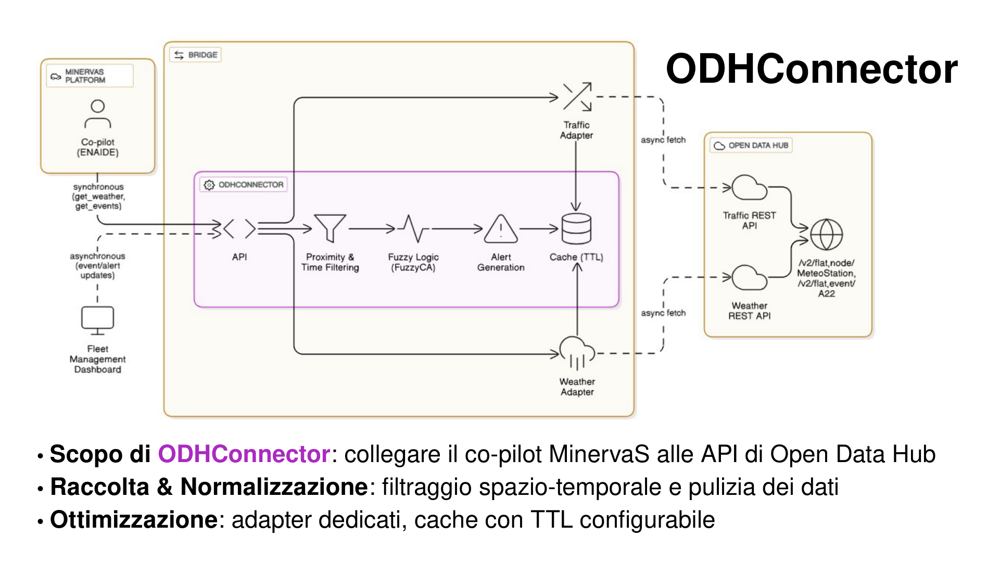
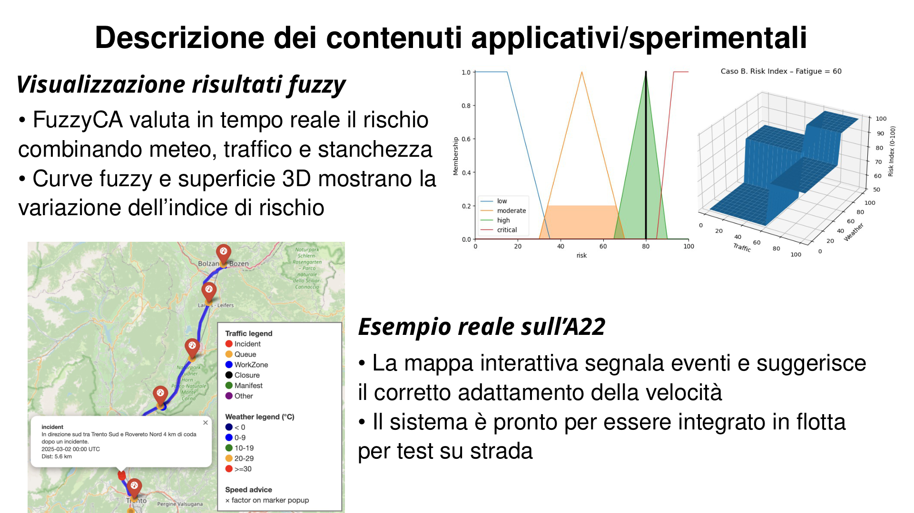
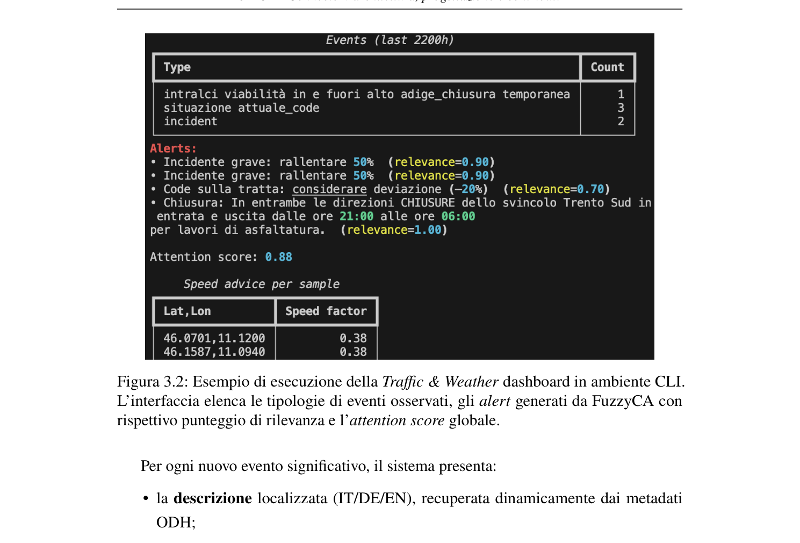
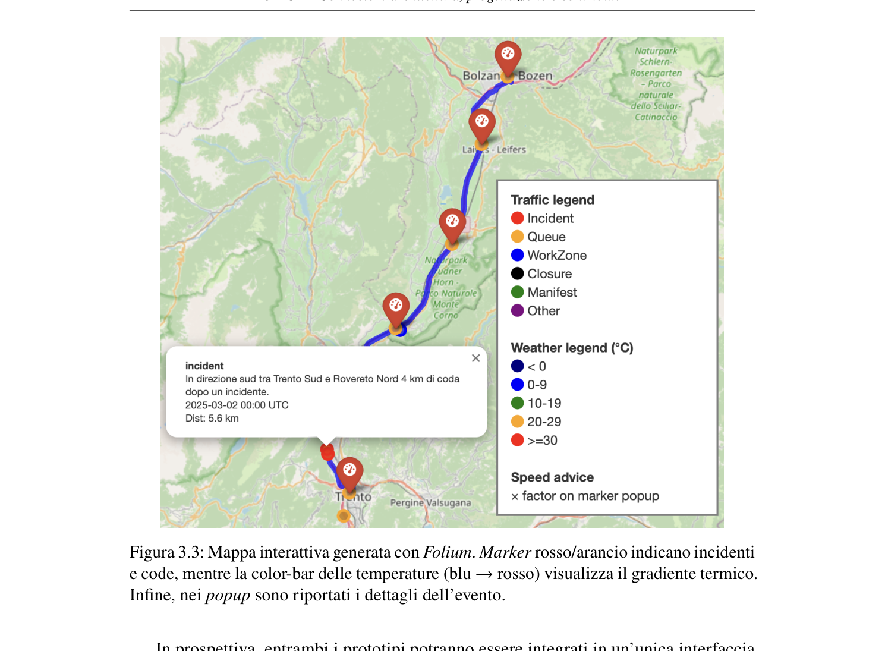

# Bachelor Thesis @ MinervaS — V2X Co-pilot (ODHConnector + FuzzyCA)

Portfolio/educational version of the work developed during my Bachelor thesis internship at **MinervaS** (Apr–Jul 2025).  
Goal: enrich a heavy-vehicle co-pilot with **real-time traffic + weather data** (Open Data Hub, A22 corridor), enabling **TTL caching**, **alert generation**, and **live monitoring dashboards**.

> Disclaimer: this repository is published for portfolio purposes. Sensitive/internal details (endpoints, credentials, proprietary data) have been removed or anonymized.

---

## What I built

- **ODHConnector**: unified gateway for traffic + weather sources, with configurable **TTL caching** and spatio-temporal filtering.
- **Data adapters**: normalization of heterogeneous API responses into a consistent internal model.
- **Alert generation**: localized, actionable recommendations (e.g., speed adaptation) based on nearby events/conditions.
- **Monitoring dashboards**:
  - CLI live dashboard (Python `rich`)
  - Interactive map dashboard (Folium)
- **FuzzyCA**: fuzzy-logic risk assessment combining exogenous signals (traffic/weather) with endogenous factors (e.g., driving profile/fatigue proxies) to compute a continuous risk index and explainable advice.

---

## Architecture & Demo

### ODHConnector pipeline


### FuzzyCA (membership + risk surface + example)


### Live CLI monitoring


### Interactive map dashboard


---

## Repository structure (as-is)

This repo contains multiple iterations/modules produced during the internship:
- `ODHconnector/` — connector + adapters + caching + alerts
- `MeteoAPI/`, `TrafficAPI/`, `OpenDataHub/` — supporting modules / experiments
- `Fuzzy/` — fuzzy logic (FuzzyCA) components
- `TargetX/`, `mato/` — auxiliary deliverables / iterations

---

## Minimal setup (optional)

If you want to run parts locally, create a virtual environment and install dependencies (adjust to your modules):

```bash
python -m venv .venv
source .venv/bin/activate   # macOS/Linux
# .venv\Scripts\activate    # Windows

pip install -r requirements.txt
```
